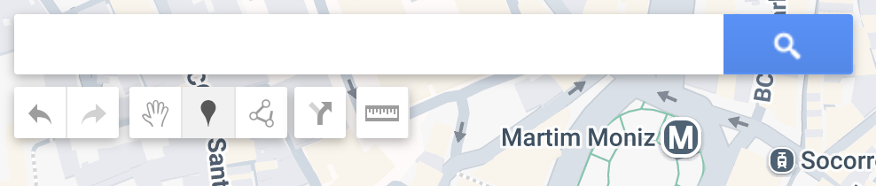
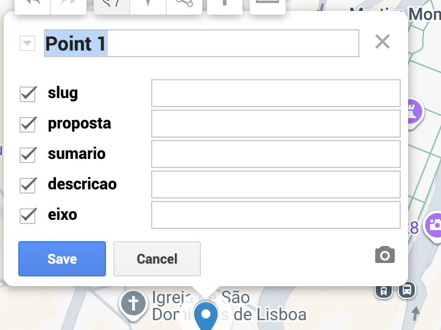
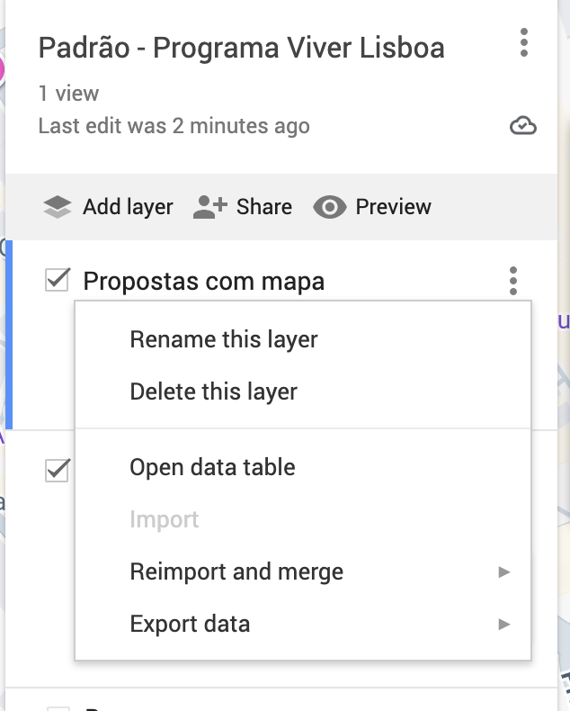
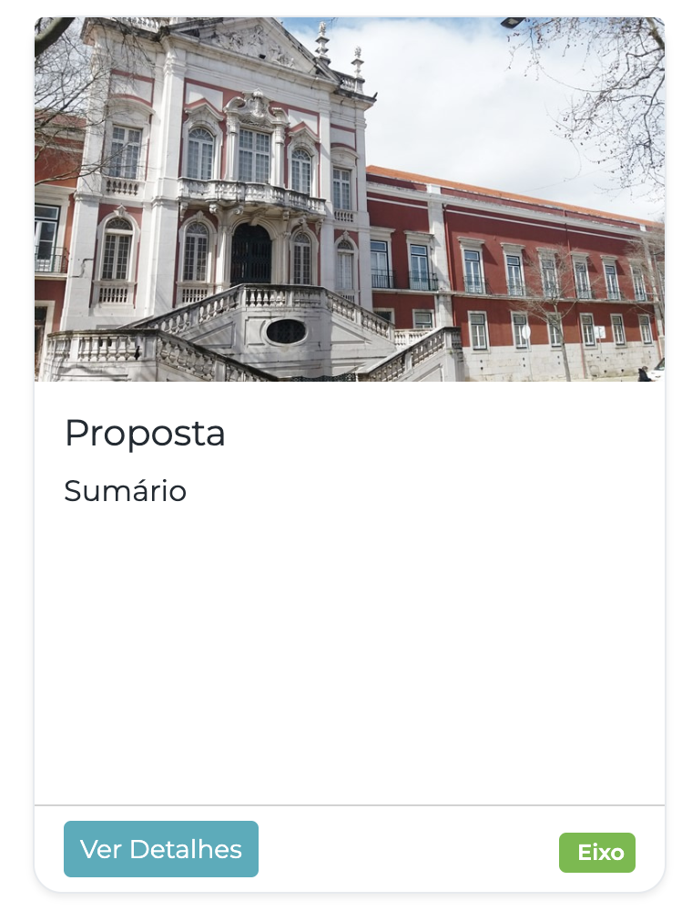

## Instrucoes

A edição das propostas é feita através do My Google Maps - peça ao Patrick acesso de edição.

Devem existir 2 camadas em cada mapa:
1. Camada 1 terá propostas com localizações
2. Camada 2 terá propostas sem uma localização específica

### Processo para criar uma proposta

1. Use o botão marcador "📍" ou o botão polígono "💠" para criar a área de interesse, isto garante que a proposta tem uma localização.

2. Isto abrirá um popup de edição que pode usar para preencher detalhes básicos e *carregar imagens*, mas é melhor ignorar isso e preenchê-lo através da tabela de dados.

3. Abra a tabela de dados para a camada:

4. Introduza os detalhes na tabela de dados:

### Definições das propostas

Consulte o My Google Maps para Arroios para ver alguns exemplos.

- *slug*: Para criar o URL para cada proposta, e.g. em Arroios temos `academia-militar-reconversao` que é usada no URL `https://arroios.viver-lisboa.org/propostas/academia-militar-reconversao/`
- *nome*: O nome do sitio, pode ser o mesmo que a proposta. Por exemplo para arroios, temos a mesma proposta 3 vezes para os 3 mercados (Arroios, Forno do Tijolo e 31 de Maio)
- *proposta*: O nome da proposta
- *sumario*: Um sumário que aparece tanto no popover do mapa como no indice das propostas
- *descricao* A descrição
- *eixo*: A categoria da proposta

#### Seccoes do site para ilustrar as Definições
##### Cartão de proposta

